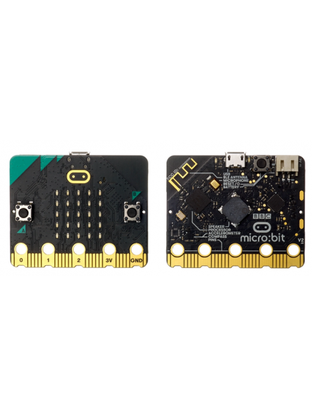

# ¿Qué es STEAM? ¿Qué es una placa Microbit? 
El término STEAM surge de las siglas en inglés de:  Science, Technology, Engineering, Arts & Mathematics.

Una placa de microbit es una placa programable, es decir, una placa con un procesador y otros componentes que la convierten en una pequeña computadora cuyo comportamiento podemos programar de forma sencilla 

