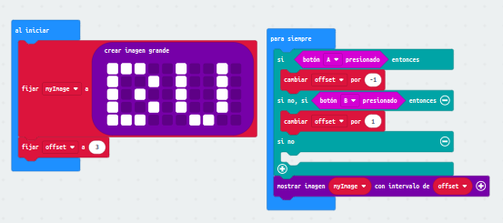

# Modulo 3
## Ejercicio 1
En el primer ejercicio deberemos usar una variable para que, al pulsar A o B, el numero mostrado en pantalla aumente o disminuye de valor.
Al presionar el boton A, irá disminuyendo en 1, al presionar el B, irá aumentando.

## Ejercicio 2
Aquí aprovecharemos el uso de la variable anterior de una forma similar para mostrar una imagen mas grande de lo que cabría en la microbit, por lo que
debera ir desplazandose segun pulsemos los botones. Al presionar A, se desplazara a la izquerda, al presionar B, a la derecha.

# actividades completadas
- [Ejercicio 1](microbit-modulo3act1ampliacion.hex)
- [Ejercicio 2](microbit-modulo3act2.hex)
