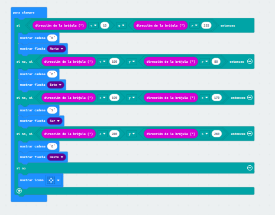

## Primer proyecto
En este proyecto se hara los puntos cardinales en la placa de microbit es decir que hay que poner un valor entre 0 a 355 no enseñara el norte, si esta entre 100 o 80 saldra en la microbit la palabra E del este, si esta entre 190 o 170 esta dirigido hacia el sur, si esta entre el 260 o 280 señalara el oeste

